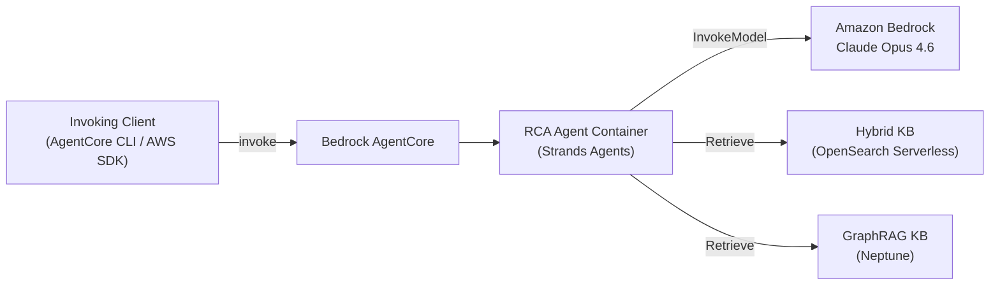

# Manufacturing RCA Agent

An AI-powered root cause analysis agent for manufacturing quality investigations. Built on [AWS Bedrock AgentCore](https://docs.aws.amazon.com/bedrock/latest/userguide/agentcore.html) with the [Strands Agents](https://github.com/strands-agents/sdk-python) framework.

## Problem

Manufacturing quality investigations require processing large volumes of data scattered across many sources — deviation reports, equipment logs, batch records, supplier quality data. These investigations are manual, time-consuming, and often stall because of the fragmented nature of the data. This agent automates the investigation process by consolidating knowledge from multiple sources and applying a structured root cause analysis methodology, reducing investigation time from days to minutes.

## Architecture



The agent runs as a container on Bedrock AgentCore. On each invocation, it calls Claude Opus 4.6 via Bedrock for reasoning and retrieves manufacturing data from two Knowledge Bases — one using hybrid search (OpenSearch Serverless) and one using GraphRAG (Neptune). Both KBs are queried together: hybrid search excels at keyword-precise lookups (e.g. lot numbers, equipment IDs), while GraphRAG discovers cross-document relationships between entities (e.g. tracing a defect back through suppliers, equipment, and process changes). Infrastructure is deployed via CDK; the agent container is built and pushed to ECR automatically by the AgentCore CLI.

## Investigation Pipeline

The agent follows a structured 3-step methodology modeled after manufacturing root cause analysis standards (e.g. 8D, Ishikawa). Each step executes as a separate invocation to keep within timeout limits and allow inspection between steps:

```
Incident → Problem Definition → Root Cause Analysis → Verification → Root Causes
```

1. **Problem Definition** — Identifies affected items, establishes timeline, classifies items as reference (known good) vs study (potentially affected)
2. **Root Cause Analysis** — Queries Knowledge Bases to identify potential causes with supporting evidence
3. **Verification** — Verifies each cause by comparing reference vs study items, determining a RETAINED or ELIMINATED verdict

Each step is driven by an SOP (Standard Operating Procedure) defined in `app/RCAAgent/sops/`. The SOPs define the methodology — what to query, how to classify, what output format to produce.

## Sample Data

The `data/` directory contains 40 synthetic manufacturing documents (txt, csv, pdf) that are automatically uploaded and indexed into the Knowledge Bases during deployment. They simulate a realistic manufacturing environment across 13 document categories — batch records, QC reports, deviation reports, equipment logs, supplier quality data, risk analyses, maintenance records, and more. This represents the types of documents a quality engineer would typically search through during a real investigation.

## Prerequisites

- AWS account with Bedrock model access enabled (Claude Opus 4.6)
- AWS CLI configured with valid credentials
- CDK bootstrapped (`cdk bootstrap aws://ACCOUNT_ID/REGION`)
- [Node.js](https://nodejs.org/) with CDK CLI (`npm install -g aws-cdk`)
- Python 3.12+
- [uv](https://docs.astral.sh/uv/) (Python package manager)

> **Note:** The `agentcore` CLI is installed automatically by `uv run deploy` if not already present.

> **Note:** This sample targets **EU regions** (default: `eu-central-1`). The model inference profile (`eu.anthropic.claude-opus-4-6-v1`) is EU-specific. If deploying in another region, update the `MODEL_ID` environment variable (e.g. `us.anthropic.claude-opus-4-6-v1` for US regions).

## Quick Start

```bash
# 1. Set your AWS account ID (find it with: aws sts get-caller-identity --query Account --output text)
vim agentcore/aws-targets.json
```

Replace the placeholder with your 12-digit account ID:

```json
[
  {
    "name": "default",
    "account": "123456789012",
    "region": "eu-central-1"
  }
]
```

```bash
# 2. Deploy everything (infra + data + agent + smoke test)
uv run deploy
```

The CLI deploys CDK infrastructure (S3, OpenSearch Serverless, Neptune, Knowledge Bases), uploads sample manufacturing data, deploys the agent via AgentCore, and runs a smoke test.

### Running individual steps

```bash
uv run deploy infra     # Deploy CDK infrastructure only
uv run deploy ingest    # Upload data + wait for ingestion
uv run deploy agent     # Deploy AgentCore agent + patch permissions
uv run deploy test      # Run smoke test
uv run deploy destroy   # Tear down everything
```

### Testing the agent

Quick one-shot validation:

```bash
agentcore invoke '{"step": "step1", "prompt": "Investigate quality deviation on product NEXUS CK MB Reference 30421. Lot 1009900940 reported calibration error B18 on S1 signal exceeding 550 RFV specification limit."}'
```

Interactive 3-step investigation:

```bash
python scripts/invoke_agent.py
```

```
======================================================================
  Manufacturing RCA Agent
======================================================================

  Describe a quality issue and I will investigate it using
  a 3-step root cause analysis methodology.

  Examples:
    "Defect found in production batch BATCH-2026-001"
    "Quality deviation on assembly line 3, reported 2026-03-10"
    "Customer complaint about product ABC-123"

  Type quit to exit.
======================================================================

You>
```

## Local Development

```bash
cd app/RCAAgent
uv sync --dev
AWS_REGION=<your-region> KB_HYBRID_ID=<hybrid-kb-id> KB_GRAPHRAG_ID=<graphrag-kb-id> agentcore dev
```

The dev server starts at `http://localhost:8080/invocations` with hot reload.

View runtime logs:

```bash
agentcore logs                       # Stream logs in real-time
agentcore logs --since 1h            # Search historical logs
```

## Configuration Reference

| Variable | Description |
|----------|-------------|
| `MODEL_ID` | Bedrock model ID (default: `eu.anthropic.claude-opus-4-6-v1`) |
| `RETRIEVAL_MODE` | `hybrid`, `graphrag`, or `both` (default: `both`) |
| `LOG_LEVEL` | Logging level (default: `INFO`) |

## Teardown

```bash
uv run deploy destroy
```

## Security

See [CONTRIBUTING](CONTRIBUTING.md#security-issue-notifications) for more information.

## License

This sample code is made available under the MIT-0 license. See the [LICENSE](LICENSE) file.

> **Disclaimer:** This is sample code for demonstration and educational purposes only, not for production use.
